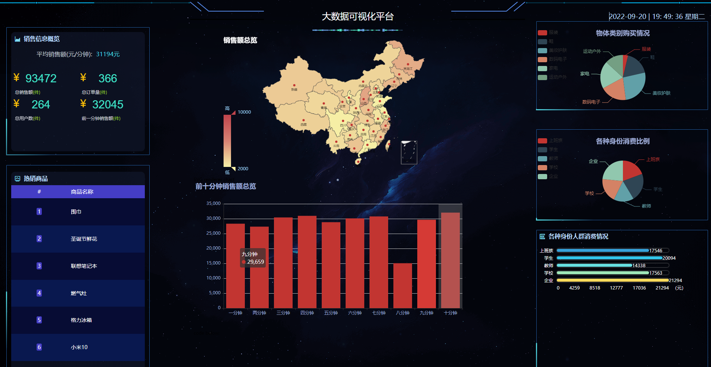

基于flink的大数据流式计算平台
=============================


### 一、项目描述

项目分为一下几部分：

1. 前端部分:react+echarts
2. Web后台部分：Spring boot2.1
3. 流式计算部分：jdk1.8+Flink1.0+kafaka2.0+zookeeper3.5+redis4.0

### 二：项目界面图



### 三：项目目录介绍

后端部分

```
flink
├── DSInfoService 模拟数据
│────── control 
│  │  │   │ ── Dsapplicationstart (Sping boot启动)
│  │  │   │ ── DSinfoService (提供对外服务接口)
│  │  │   │ ── KafkaProducerConfig (kafka配置文件)
│────── utils 存放Redis等一些工具类
├── flinkAnalyse
│  │  │── KafkaWriter mock一些假数据传入kafka中
│  │  ├── topNJob 使用flink提供实时流式计算
│  │  ├── models Dva模型管理
│  │  ├── routes 路由主界面定义
│  ├── index.js 主函数文件
│  └── router.jsx 路由定义文件
│
└── .roadhogrc.mock.js 导出模拟数据
```

前端部分：

TODO

### 四：项目启动

1. 安装Redis，Kafka 和zookeeper，并完成redis，zookeeper的基本配置，并启动
2. 修改`KafkaProducerConfig` 中的kafka配置信息，`util`中的redis配置信息
3. 启动后端，先启动KafkaWriter，将生成一些数据放入消息队列kafka中，再启动`Dsapplicationstart`启动spring boot对外服务
4. 启动前端，先安装nodejs，使用npm install 安装`package.json`中的依赖包，然后执行`npm start`启动前端
5. 打开`localhost:9000`就可以看到界面展示


### 五、其余

这个项目是个人的作品，还有很多大大小小的bug，后续尽力去更新和完善，不断学习